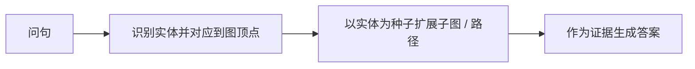
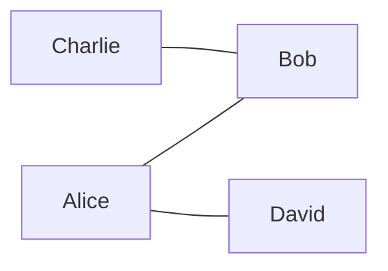

# 图算子实现任务

## 任务引入

GraphRAG 在生成答案前，先把自然语言问句落到知识图上，再把图上的证据交给语言模型。常见流程是：

1. 从问句中识别实体（及关系），并对应到图中的顶点；
2. 以这些顶点为种子，在图上扩展出一块相关子图（或若干路径），作为证据；
3. 将子图序列化为文本或结构，供后续回答使用。




**例。** 问句「Alice 和 Charlie 是否认识同一个人？」识别出实体 Alice、Charlie，对应图中两个顶点。扩展可以是：二者的共同邻居（`CommonNeighbors`）、各自 2 跳以内的点（`KHop`）、或二者之间的最短路（`ShortestPath`）。若只取 Alice 的一跳邻居而 Charlie 一侧未扩到，则可能漏掉中间人；若从 Alice 沿边走到整张连通部分，则可能把与问句无关的点都送进模型。本任务要做的就是把这类扩展写成可调用的算子。




上图中 Bob 是 Alice 与 Charlie 的共同邻居，足以回答该问句；David 仅与 Alice 相连。合适的扩展应包含 Bob，而不必把与问句无关的整块连通分量一并取出。

其中第 2 步决定证据是否够用、是否过宽。扩展过小则召回不足，过大则噪声过多。因此需要一组**从图上的种子实体出发、取出相关点集或路径**的算子，供检索阶段调用。

本任务只覆盖上图中的**扩展**一步：在图上实现若干命名算子（给定种子顶点，返回点集或路径），按下文接口接到系统里，并在网页上画出结果。问句如何抽实体、实体如何对齐到顶点、子图如何送进语言模型，均不在范围内。仓库里已有按同样方式调用的图算法（例如从某点出发取全部可达点、求连通块），实现时沿用该调用方式即可，详见第一节。

本文规定各算子的**问题定义**与**对外调用约定**（入口、参数、返回值及 Web 序列化方式）。实现算法自行设计或依据文献完成，不在本文给出。`PPR`、`PCST` 所列论文用于界定问题与参考实现；其余算子以本节及第三节的定义为准。

---

## 一、仓库已经提供的接口

会话里的 `g` 必须是：

```groovy
g = graph.traversal(SecondOrderTraversalSource.class)
```

Web 连上后会自动执行。已有命名算子：


| 调用                                           | 含义（只需会用，不必改）     |
| -------------------------------------------- | ---------------- |
| `g.BFS(id).execute()`                        | 从 `id` 出发能走到的全部点 |
| `g.WCC()` / `g.SCC()` / `g.Community()`      | 连通分量 / 社区        |
| `g.Subgraph().addV(...).addE(...).execute()` | 子图模式匹配           |


标准 Gremlin（`g.V(1).out()`）仍然可用，用来读图。

### 1. 入口 + Builder

在 `SecondOrderTraversalSource` 增加一个方法，只负责 `new XxxQueryBuilder(this, ...)`。

新建 `src/main/java/db/monacgraph/so/XxxQueryBuilder.java`：

- 链式参数返回 `this`
- `execute()`：给 Java / Gremlin，返回点集、路径等
- `executeForWeb()`：交给网页。查询必须以它结尾，否则画不出图

读图用 TinkerPop：


| 需求      | 接口                                  |
| ------- | ----------------------------------- |
| 按 id 取点 | `g.V(id).next()`                    |
| 全部点     | `g.V().toList()`                    |
| 无向邻居    | `v.vertices(Direction.BOTH)`        |
| 出边 / 入边 | `v.edges(Direction.OUT)` / `IN`     |
| 边的两端    | `e.outVertex()`、`e.inVertex()`      |
| 属性（如权重） | `e.property("weight")`；任务里约定缺省时的默认值 |


### 2. 算出子图之后交给 Web

按下面四步完成 `executeForWeb()`。

1. **算出结果。** 得到一块或多块子图。每一块是顶点列表，以及要画的边（路径、PCST 等已有边）；若只要点集上的诱导子图，可以暂不列出边。
2. **收成 `ResultSubgraph`。** 有明确边时用 `ResultSubgraph.of(vertices, edges)`（只画这些边）；只要点集时用 `ResultSubgraph.induced(vertices)`（自动补上两端都在点集里的边）。多块则每一块各收一次，放进 `List`。
3. **交给公开接口。**
  `VsetResultSerializer.serializeSubgraphs(List<ResultSubgraph>)`
4. **网页可跑。** 在 `web-client/src/App.vue` 的 `exampleQueries` 增加一条以 `.executeForWeb()` 结尾的查询；重新打包并启动服务后再打开页面。

```java
public Map<String, Object> executeForWeb() {
    List<ResultSubgraph> pieces = new ArrayList<>();

    // 一块：List 里只放一个；多块（如 k 条最短路）：循环 add
    pieces.add(ResultSubgraph.of(vertices, edges));
    // 诱导子图则改为：pieces.add(ResultSubgraph.induced(vertices));

    return VsetResultSerializer.serializeSubgraphs(pieces);
}
```

```javascript
{ title: 'KHop', query: 'g.KHop(1).depth(2).executeForWeb()' }
```

---

## 二、交付

1. 入口方法 + `*QueryBuilder`（`execute` / `executeForWeb`）
2. Web 上一条能跑通的 `executeForWeb()` 示例
3. 结果符合下表对应算子的问题定义

★ 较易。


| 算子              | 难度    | Web 用                     |
| --------------- | ----- | ------------------------- |
| KHop            | ★     | `induced`                 |
| CommonNeighbors | ★     | `induced`                 |
| Induced         | ★     | `of` 或 `induced`（边必须是诱导边） |
| RandomWalk      | ★★    | `induced`                 |
| KCore           | ★★    | `induced`                 |
| ShortestPath    | ★★    | `of`（路径上的点与边）             |
| PPR             | ★★★   | `induced`                 |
| KShortest       | ★★★★  | 每条路径一个 `of`               |
| PCST            | ★★★★★ | `of`（选出的点与边）              |


---

## 三、各算子：问题与要求的调用

### 1. KHop · ★

求出与起点 `s` 图距离 ≤ `k` 的全部顶点（含 `s`）。图距离 = 最少走几条边。超过 `k` 的不要。现有 `g.BFS(s)` 没有距离上限。

```java
g.KHop(s).depth(2).execute();
```

---

### 2. CommonNeighbors · ★

两个点 `s`、`t` 的邻居交集，不含端点。没有则为空。

```java
g.CommonNeighbors(s, t).execute();
```

---

### 3. Induced · ★

给定点集 `V`，点仍是 `V`，边是原图中两端都在 `V` 里的边。不挑点、不删点。

```java
g.Induced(vertices).execute();
```

---

### 4. RandomWalk · ★★

从 `s` 出发做有限条、有限步的随机游走，输出被走到的点（可按次数截断）。结果可波动。

```java
g.RandomWalk(s).walks(50).length(4).execute();
```

可选 `reset(α)`：每步有概率回到 `s`。

---

### 5. KCore · ★★

求尽量大的一块子图，使其中每个点在这块内部的度数 ≥ `k`。最大这样的子图唯一。可选只在给定点集的诱导子图上求。

```java
g.KCore().k(2).execute();
g.KCore().on(vertices).k(2).execute();
```

---

### 6. ShortestPath · ★★

一对 `s`、`t`，找 **边权 cost 之和最小** 的一条路。未给 `cost` 时每条边为 1。解是点序列；多条同样短任取一条。不可达或超过 `maxLength` 则为空。只要一条；前 k 条见 KShortest。

```java
g.ShortestPath(s, t).cost(edgeCosts).maxLength(4).execute();
```

---

### 7. PPR · ★★★

Personalized PageRank。从起点 `s`（可多个）给每个点打分，留下 `topK`。`reset(α)` 为拉回起点的概率，建议默认 `0.15`。

```java
g.PPR(s).reset(0.15).topK(50).execute();
```

论文：[HippoRAG](https://papers.nips.cc/paper_files/paper/2024/file/6ddc001d07ca4f319af96a3024f6dbd1-Paper-Conference.pdf)（NeurIPS 2024）。本任务只做图上的 PPR。

---

### 8. KShortest · ★★★★

`s` 到 `t` 的 k 条不绕圈的路，按 cost 之和从短到长。第 1 条与 ShortestPath 的权和相同。点在一条路里不重复。不够 k 条则有多少算多少。`k` 宜小（3～5）。

```java
g.KShortest(s, t).k(5).cost(edgeCosts).maxLength(4).execute();
```

---

### 9. PCST · ★★★★★

Prize-Collecting Steiner Tree：一块**连通**的点+边，不是最短路的并。最大化：

```text
选出的点 prize 之和 − 选出的边 cost 之和
```

允许放弃奖金不够的点。未给 `cost` 时边权为 1。

```java
g.PCST().prize(vertexPrizes).cost(edgeCosts).execute();
```

论文：[G-Retriever](https://proceedings.neurips.cc/paper_files/paper/2024/file/efaf1c9726648c8ba363a5c927440529-Paper-Conference.pdf)（NeurIPS 2024）。